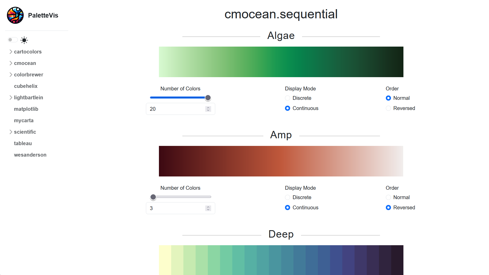
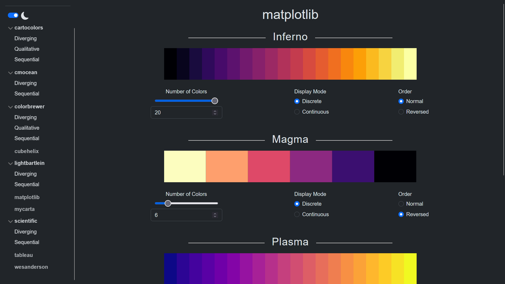

# PalleteVis

A quick way to visualize all the palettes available in the Python module `palettable`.

The palettable module is a great resource for color palettes. However, it can be difficult to visualize all the palettes available. This module attempts to solve this issue by providing a web interface to view all palettes grouped by their sources.

The interactive interface is built with Bootstrap 5 and the Flask backend allows the user to change the number of colors displayed in each palette, the order of the colors (normal or reversed), and the display mode (discrete or continuous).

Note that the images are cached to avoid generating the same request multiple times. As a learning experience, the code quality may not be the best and no tests were made, so expect a few bugs. The logo was courtesy of DALL-E.

## Running the app

To run the app, first install the requirements:

```
pip install -r requirements.txt
```

Then run the app:

```
python -m flask run
```

## Gallery




